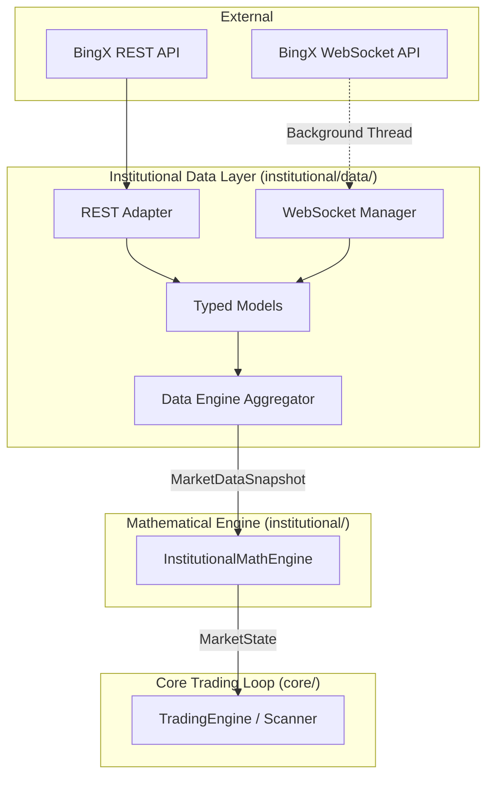

# INSTITUTIONAL DATA ARCHITECTURE

This document describes the architectural flow of institutional data acquisition for the Ophelia platform. It guarantees strict separation of concerns, ensuring that the mathematical engine operates on pure market data without any coupling to exchange-specific implementations or execution logic.

## Core Architectural Principles

1.  **Isolation**: The Data Layer is strictly read-only. It must never invoke order execution endpoints (`place_order`, `cancel_order`, `set_leverage`, `modify_position`).
2.  **Normalization**: All external representations of data (e.g., BingX JSON) must be normalized into internal typed models (`TradeEvent`, `OHLCVBar`, `OrderBookSnapshot`) immediately upon reception.
3.  **Resilience**: The Trading Engine and Mathematical Engine run synchronously. The Data Layer manages high-frequency streaming data (e.g., WebSockets) using isolated threads and `threading.RLock`, ensuring the core loop never blocks.
4.  **Provenance**: Every `MarketDataSnapshot` carries metadata defining its origin, timeframe, symbol, data quality, and freshness.

## Flow of Data

## Component Roles

### 1. Typed Models (`institutional/data/models.py`)
Defines the canonical language for market data within Ophelia. These dataclasses (like `MarketDataSnapshot`) remove any trace of BingX field names or API versions from downstream systems.

### 2. REST Adapter (`institutional/data/rest_adapter.py`)
Dedicated client for public market data endpoints. Handled synchronously. Used for heavier, lower-frequency payloads like OHLCV klines and full depth snapshots.

### 3. WebSocket Manager (`institutional/data/websocket_manager.py`)
Background daemon using `websocket-client`. Receives live ticks (e.g., trades) and aggregates them. Uses `threading.RLock` to safely protect its internal state from the main execution thread.

### 4. Data Engine (`institutional/data/engine.py`)
The orchestrator. It queries the REST Adapter and drains the WebSocket Manager's aggregated buffers to construct a complete, timestamped `MarketDataSnapshot` when requested by the `InstitutionalMathEngine`.

## Concurrency Model

Ophelia retains its synchronous `TradingEngine` design. 
To accommodate this without converting the entire codebase to `asyncio` (as mandated), the `WebSocketManager` spins up a single daemonized standard library `Thread`. Data is pushed to in-memory buffers protected by threading locks. When `engine.get_snapshot()` is called by the main thread, it acquires the lock, retrieves the latest aggregated events, clears the buffer, and releases the lock, allowing `O(1)` synchronization.
