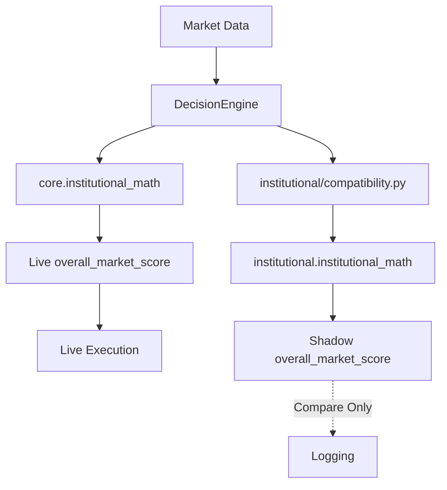

# Phase 5B: V3 Compatibility & Translation Layer Implementation Plan

## 1. Trace the Legacy Contract

In `core/institutional_math.py`, `MathAnalysis` produces:
- **`volatility_score`** [0.0 - 10.0]: `(bbs * 5.0) + (rvol20 * 2.0)`. Consumer: `DecisionEngine`. Modifies `overall_market_score` and sets `suggested_tp_buffer` to 1.15 if > 7.0.
- **`momentum_score`** [0.0 - 10.0]: `abs(nslope) * 10.0 + abs(nes) * 5.0`. Consumer: `DecisionEngine`. Modifies `overall_market_score`.
- **`trend_persistence_score`** [0.0 - 10.0]: `min(10.0, er10 * 10.0)`. Consumer: `DecisionEngine`. Modifies `overall_market_score`.
- **`market_regime`** (String): Consumer: None (Observational).

## 2. Trace DecisionEngine Consumer

The `DecisionEngine` calculates `overall_market_score` by taking a base score of 5.0 and adding/subtracting weights based on the legacy floats.
- **Effect on Leverage**: If `overall_market_score` > 7.0, leverage = 20x. If < 4.0, leverage = 10x.
- **Effect on Trading**: None. The `approved` boolean ignores the `overall_market_score` entirely and relies strictly on candle size percentages (0.20%, 0.40% limits) and independent Kronos triggers.

## 3. V3 → Legacy Compatibility Matrix

| Legacy Field | Current Meaning | V3 Candidate Source | Mathematical Compatibility | Transformation Required | Risk |
| :--- | :--- | :--- | :--- | :--- | :--- |
| `volatility_score` | Magnitude (0-10) | `MarketState.volatility_score` | **YES** | Convert advisory int to float. | Low |
| `momentum_score` | Magnitude (0-10) | V3 Robust Z-Score (`mom_current`) | **NO** | Transform: `min(10.0, abs(z_score) * 3.33)`. | Med |
| `trend_persistence` | Magnitude (0-10) | V3 `efficiency_ratio` (0-1) | **YES** | Transform: `er * 10.0`. | Low |

## 4. Overall Market Score Treatment

**Recommendation:** Run legacy and V3 in parallel (Shadow Mode).
V3 calculates its state from completely different principles (realized volatility percentiles, robust MAD). It cannot mathematically reproduce the raw Indicator Summation (BBS+RVOL). We will introduce `shadow_market_score` inside the `DecisionEngine`.

## 5. Shadow Mode Architecture (No Silent Behavior Change)

V3 will be fully executed but its outputs will be discarded before order placement.

## 6. Microstructure Treatment

Fields: `spread`, `queue_imbalance`, `depth_imbalance`, `microprice`, `book_slope`, `cvd`, `tvi`.
- **Classification**: **OBSERVATIONAL**
- They will be attached to the `MarketState` but mapped to `UNAVAILABLE` or `None` in the legacy `MathAnalysis` response. They will have 0 impact on leverage or TP buffers.

## 7. OFI Absolute Rule

OFI will remain **UNAVAILABLE**. No microstructure variable (`depth_imbalance`, `CVD`) will be aliased to OFI.

## 8. Data Quality

- If V3 returns `DataQuality.INSUFFICIENT_DATA`, the compatibility layer will translate this to `UNAVAILABLE` (String) or `None`, which is safely bypassed by the existing `isinstance(score, (int, float))` checks in `DecisionEngine`.
- It will NOT default to `0`.

## 9. Test Strategy

1. Mock V3 outputs and verify `DecisionEngine.evaluate()` returns the exact same `approved` boolean.
2. Verify `V3Translator` maps `DataQuality.UNAVAILABLE` to `None` for floats.
3. Ensure no `ofi` alias exists in the translated output.
4. Verify `RiskManager` and `OrderManager` tests continue to pass.

## 10. Recommended Implementation Order

1. **Phase 5B.1 — Compatibility Contract**: Write `institutional/compatibility.py` (`V3Translator`).
2. **Phase 5B.2 — Shadow-mode Integration**: Hook up `V3Translator` inside `core/decision_engine.py` without replacing legacy math.
3. **Phase 5B.3 — Parallel Validation**: Compare outputs.
4. **Phase 5B.4 — Controlled Advisory Integration**: Let V3 take over the `suggested_leverage` generation.
5. **Phase 5B.5 — V3 Production Authority**: Fully deprecate `core.institutional_math.py`.
